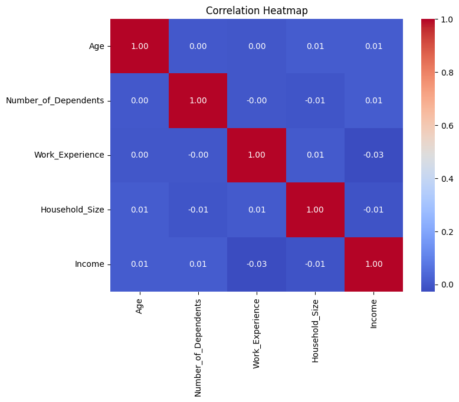
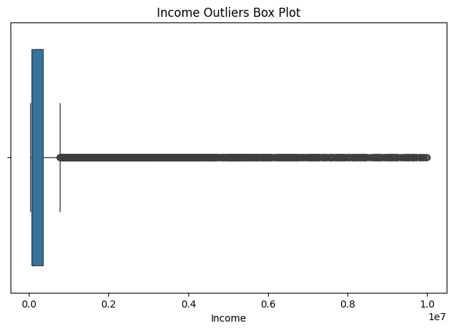
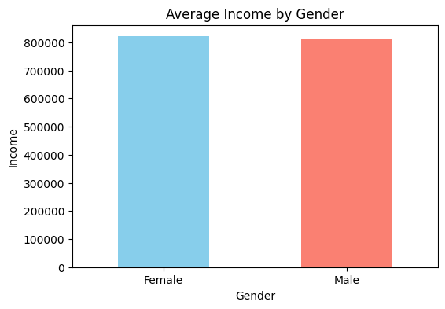
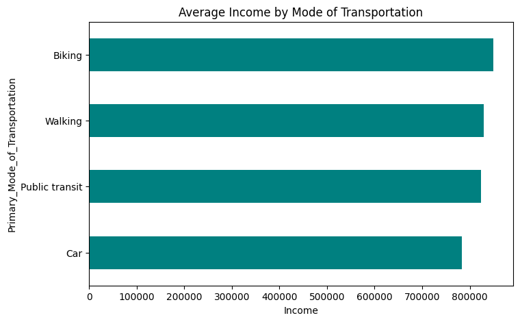

# Demographic and Socioeconomic Data Analysis

A comprehensive Exploratory Data Analysis (EDA) project focusing on investigating demographic, social, and economic indicators, patterns, and statistical relationships using Python.

---

## 📋 Table of Contents
- [Project Overview](#-project-overview)
- [Dataset Features](#-dataset-features)
- [Tools & Libraries Used](#-tools--libraries-used)
- [Data Analysis & Key Visualizations](#-data-analysis--key-visualizations)
- [Key Insights & Findings](#-key-insights--findings)

---

## 🔍 Project Overview
This project dives deep into exploring socioeconomic datasets to uncover hidden patterns between individuals' personal backgrounds and their economic status. By leveraging data manipulation and statistical visualization techniques, the analysis highlights how factors like age, household size, work experience, and transportation choices correlate with income levels.

---

## 📑 Dataset Features
The dataset includes several key demographic and economic variables:
* **Age:** The age of the individual.
* **Gender:** The gender classification of the respondents.
* **Income:** The monetary earnings/income level.
* **Work Experience:** Total years of professional experience.
* **Household Size:** Total number of individuals living in the household.
* **Number of Dependents:** Number of family members financially dependent on the individual.
* **Primary Mode of Transportation:** The primary commute method used.

---

## 🛠️ Tools & Libraries Used
The entire analysis was performed in **Google Colab** using Python:
* **Pandas & NumPy:** For data cleaning, manipulation, and mathematical calculations.
* **Matplotlib & Seaborn:** For generating advanced statistical graphs and heatmaps.

---

## 📊 Data Analysis & Key Visualizations

### 1. Correlation Matrix Heatmap
This heatmap evaluates the linear correlation coefficients between numerical variables (Age, Number of Dependents, Work Experience, Household Size, and Income), showing how strongly these features relate to one another[cite: 14].

### 2. Income Distribution & Outliers (Box Plot)
This visualization displays the spread of the income data, helping to identify skewness and potential statistical outliers within the population[cite: 15].

### 3. Average Income by Gender
Bar charts comparing how average income levels vary across different gender categories[cite: 12].

### 4. Average Income by Mode of Transportation
Horizontal bar charts showing the relationship and differences in average income based on primary commuting methods[cite: 13].

---

## 💡 Key Insights & Findings
* **Correlations:** The heatmap demonstrates the statistical dependencies and linear associations across variables like work experience and income growth.
* **Outliers Detection:** The box plot analysis effectively isolates income extremes, giving a clearer picture of economic distribution.
* **Socioeconomic Trends:** Grouping data by transportation and gender highlights distinct lifestyle and economic clusters within the dataset.
